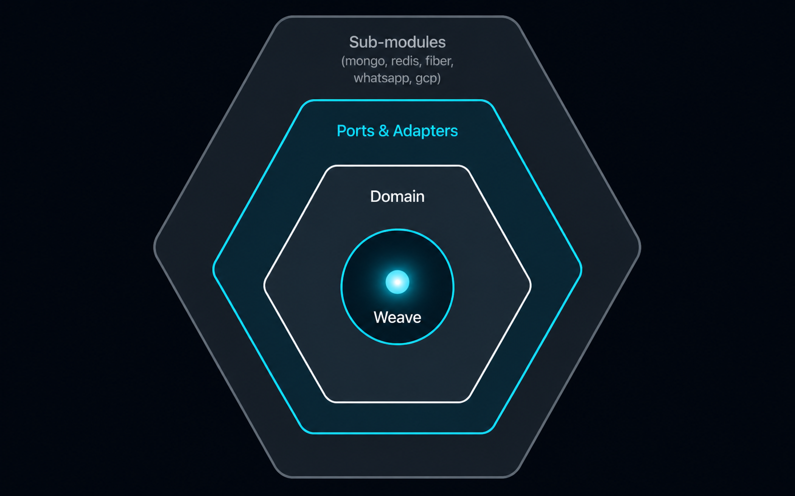
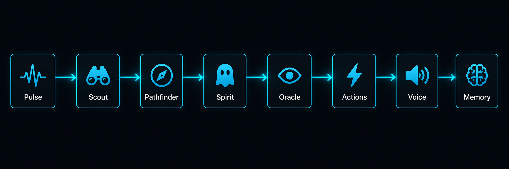

# 🏗️ Eywa Architecture

<p align="center">
  
</p>

## Overview

Eywa follows a strict **hexagonal architecture** (ports & adapters). The domain layer defines what things *are* and what behaviors they *need* — expressed as interfaces (ports). The infrastructure layer provides concrete implementations that plug into those ports without the domain ever knowing the details.

```
github.com/wmulabs/eywa            ← public facade: type aliases + constructors
├── internal/
│   ├── domain/
│   │   ├── entities/              ← core types: Pulse, Spirit, Memory, Link, Ritual, ...
│   │   ├── ports/                 ← interfaces: Oracle, Scout, Action, Bond, Keeper, ...
│   │   └── errors/                ← domain error types (BusinessError, InfrastructureError)
│   ├── implementation/
│   │   ├── orchestrator/          ← Weave engine, pipeline, WeaveBuilder
│   │   ├── actions/               ← built-in Actions (update_subject, schedule_ritual, ...)
│   │   ├── archivists/            ← LLM-based Archivist
│   │   ├── oracles/               ← OracleFactory that routes to registered providers
│   │   ├── pathfinders/           ← built-in LLM Pathfinder
│   │   ├── receptors/             ← APIDefaultReceptor (built-in Receptor)
│   │   ├── registries/            ← in-memory registries for Action/Scout/Pathfinder/Voice
│   │   ├── services/              ← RitualService, AsyncIngestionService
│   │   └── voices/                ← HTTPVoice
│   └── infrastructure/
│       └── driven/
│           ├── dbg/               ← shared logger
│           └── tracer/            ← no-op tracer default
├── mongo/                         ← opt-in: MongoDB repository implementations
├── redis/                         ← opt-in: Redis Memory, Bond, Inbox, rate limiter
├── providers/
│   ├── anthropic/                 ← Anthropic Claude Oracle
│   ├── openai/                    ← OpenAI GPT Oracle (+ Ollama, Groq, Mistral, etc.)
│   ├── gemini/                    ← Google Gemini Oracle
│   ├── bedrock/                   ← AWS Bedrock Oracle (Converse API)
│   ├── vertexai/                  ← Google Vertex AI Oracle (ADC auth)
│   ├── pgvector/                  ← LoreStore: PostgreSQL pgvector
│   ├── qdrant/                    ← LoreStore: Qdrant vector DB
│   ├── pinecone/                  ← LoreStore: Pinecone serverless
│   └── weaviate/                  ← LoreStore: Weaviate
├── gcp/
│   ├── cloudtasks/                ← Cloud Tasks Keeper + OIDC middleware
│   ├── gcs/                       ← GCS Vault
│   └── gemini/                    ← Gemini image/audio/document Lens
├── fiber/                         ← opt-in: Fiber HTTP handlers + route registration
└── channels/
    └── whatsapp/
        ├── dialog360/             ← 360Dialog WhatsApp client + Receptor
        └── twilio/                ← Twilio WhatsApp client + Receptor
```

> [!IMPORTANT]
> Sub-modules import only `github.com/wmulabs/eywa` (the public facade). They never import `internal/` — Go's visibility rules enforce this boundary.

---

## 🔄 The Processing Pipeline

When `weave.ProcessEventByKey(ctx, eventKey, pulse)` is called, the Pulse runs through a sequential pipeline of steps. Each step has an independent timeout. A failure at any step terminates the pipeline and records which step failed in the Chronicle.

<p align="center">
  
</p>

```
┌─────────────────────────────────────────────────────────────────────────────┐
│                         Processing Pipeline                                 │
│                                                                             │
│  1. Validation          ← input sanity (key length, message size)          │
│  2. IdempotencyCheck    ← skip duplicate Pulses (same IdempotencyKey)      │
│  3. RateLimit           ← per-memory-key rate limiting (optional)          │
│  4. InputGuard          ← prompt injection detection (optional)            │
│  5. LockAcquisition     ← acquire Bond (distributed lock) on MemoryKey    │
│  6. MessageCoalescing   ← drain Inbox, merge buffered messages (optional)  │
│  7. Enrichment          ← run Scouts concurrently, populate Knowledge      │
│  8. SpiritSelection     ← Pathfinder picks the Spirit                      │
│  9. SpiritLoad          ← load Spirit from repository                      │
│ 10. SessionSetup        ← get or create Memory; reconstruct from Echo      │
│ 11. Archivist           ← summarize if Threads depth exceeds threshold     │
│ 12. Reasoning           ← Oracle loop: think → call Actions → respond      │
│ 13. MediaVault          ← upload media Artifacts to Vault (optional)       │
│ 14. Persistence         ← save Echo (messages) + update Memory in Redis    │
│ 15. RitualMark          ← mark Ritual as executed (if scheduled event)     │
│ 16. VoiceDelivery       ← send response via registered Voice               │
│ 17. Chronicle           ← write audit log to ChronicleRepository           │
│                                                                             │
│  Lock is released after the full pipeline completes (incl. Chronicle)      │
└─────────────────────────────────────────────────────────────────────────────┘
```

> [!NOTE]
> Optional steps are only inserted into the pipeline when the corresponding component is wired in the WeaveBuilder (e.g. IdempotencyCheck requires `WithIdempotencyStore`, RateLimit requires `WithRateLimiter`, Archivist requires `WithArchivist` or `WithDefaultLLMArchivist`).

### Step Failure Modes

| Step | Error | Fatal? | Effect |
|---|---|---|---|
| Validation | `ErrInvalidPayload` | Yes | Pipeline aborts; 400 returned to caller |
| IdempotencyCheck | `ErrDuplicateEvent` | Yes | Silent drop; 200 returned (already processed) |
| RateLimit | `ErrRateLimited` | Yes | 429 returned to caller |
| InputGuard | `ErrInputRejected` | Yes | 400 returned; injection attempt blocked |
| LockAcquisition | `ErrMemoryBusy` | Yes | 409 returned; message queued in Inbox if configured |
| LockAcquisition | `ErrLockAcquisitionFailed` | Yes (retriable) | Infrastructure error; caller should retry |
| MessageCoalescing | internal | No | Coalescing failure logged and skipped |
| Enrichment (Scout) | varies | Only if `IsCritical()=true` | Non-critical Scout failures are logged and skipped |
| SpiritSelection | `ErrSpiritNotFound` | Yes | 422 returned |
| SpiritLoad | `ErrSpiritLoadFailed` | Yes | Pipeline aborts |
| SessionSetup | `ErrSessionLoadFailed` | Yes (retriable) | Infrastructure error |
| Archivist | internal | No | Archiving failure logged; reasoning continues with full history |
| Reasoning | `ErrReasoningFailed` | Yes (retriable) | Oracle timeout/error; pipeline aborts |
| Persistence | `ErrPersistenceFailed` | Yes (retriable) | Session/Echo save failed |
| LockRelease | internal | No | Release failure logged; lock expires via TTL |
| VoiceDelivery | internal | No | Delivery failure logged; Chronicle still written |
| Chronicle | internal | No | Audit log failure logged; never blocks the response |

**Retriable errors** have `IsRetriable(err) == true`. The caller can use this flag to decide
whether to retry or dead-letter the event.

**Fatal vs. non-fatal:** A fatal step error stops further steps. Deferred steps (LockRelease,
TypingStop) always run even after a fatal error.

---

## 🧩 Core Entities

### ⚡ Pulse

The unit of work. Every event that enters the Weave is a Pulse.

```
Pulse
├── ID              — unique event identifier
├── MemoryKey       — composite key: "{channel}:{user}" (e.g. "whatsapp:+5511999999999")
├── UserMessage     — the text from the user (if any)
├── ContactPhone    — sender phone for WhatsApp events
├── Source          — origin identifier ("whatsapp_360dialog", "api", etc.)
├── EventType       — the event_key used to look up the Link
├── IdempotencyKey  — for deduplication (e.g. wamid, MessageSid)
├── SubjectKey      — active topic (e.g. "shipment:XYZ123") — scopes Memory
├── Attachments     — media artifacts (images, audio, video, documents)
├── Payload         — raw webhook data (never sent to LLM)
├── Knowledge       — PUBLIC: enriched context sent to Oracle in system prompt
└── Metadata        — PRIVATE: audit/logging only, never sent to LLM
```

> [!IMPORTANT]
> **Knowledge vs Metadata** is a critical distinction. Knowledge is what the Oracle needs to reason well (user tier, order status, etc.). Metadata is what you need for debugging (wamid, provider, phone_number_id). Only Knowledge reaches the LLM.

### 👻 Spirit

A named AI agent configuration, stored and versioned in MongoDB.

```
Spirit
├── Name              — unique identifier (used in Link.AllowedSpirits)
├── SystemPrompt      — the LLM's persona and instructions
├── AllowedActions    — []AllowedAction{Name, IsCritical, OverrideDescription}
├── ModelConfig       — provider, model, temperature, max_tokens, top_p
├── EnforceVoiceDelivery — force response through Voice even if Action sent a message
├── VoiceDeliveryInstructions — instructions for formatting the Voice response
├── BusinessErrorInstructions — instructions for responding to business errors gracefully
├── IsActive / Version  — versioning and activation state
└── Metadata          — arbitrary Spirit-level config
```

> [!NOTE]
> Every `Update` call creates a new version instead of overwriting. Activate any prior version with `POST /api/v1/spirits/:name/activate` + `{"version": N}`.

### 🧠 Memory

Ephemeral working state in Redis, keyed by `(MemoryKey, SubjectKey)`. The composite key creates isolated memory spaces: the same user can have separate memories for different subjects (e.g. "shipment:123" vs "shipment:456").

```
Memory
├── MemoryKey     — identifies the user/channel combination
├── SubjectKey    — identifies the active business subject
├── Threads       — ordered conversation messages (user + assistant + tool calls)
├── Summary       — compressed history (written by Archivist)
├── TopicFacts    — structured facts accumulated about the Subject
└── LastInteraction — timestamp for TTL extension
```

> [!TIP]
> When Memory expires in Redis (TTL elapsed), it is reconstructed from the last N Echo messages persisted in MongoDB — conversation context survives Redis restarts transparently.

### 🔗 Link

Wires an event type to the processing configuration.

```
Link
├── EventType           — the key used in ProcessEventByKey
├── InboundConverterName — Receptor name for raw payload conversion
├── RequireScouts       — ordered Scout names to run
├── PathfinderName      — Pathfinder to use (if multi-Spirit)
├── AllowedSpirits      — eligible Spirit names
├── DefaultSpirit       — fallback when Pathfinder returns empty
├── VoiceName           — Voice channel for auto-response
├── Guards              — per-field allow/block rules
└── Timeouts            — IngestionTimeout, ProcessingTimeout
```

### 🙋 Vigil

An operator takeover seat. Stored in Redis with a TTL.

```
Vigil
├── MemoryKey   — the session being held
├── OperatorID  — who acquired the seat
├── SeatSince   — acquisition timestamp
└── ExpiresAt   — auto-release time (InactivityTimeout from acquisition)
```

When a Vigil seat exists for a MemoryKey, `ProcessEventByKey` returns `ErrSessionHeld` — the AI is blocked. The operator communicates directly via `POST /api/v1/vigil/:memoryKey/echoes`.

### ✅ Rite

An async approval request created by a Spirit mid-reasoning. Stored in MongoDB.

```
Rite
├── ID          — unique identifier
├── MemoryKey   — the session awaiting decision
├── SpiritName  — the Spirit that requested approval
├── Reason      — human-readable explanation of what needs approval
├── Context     — structured data for the operator (e.g. { "amount": 49.99 })
├── Status      — pending | approved | rejected | expired
├── CreatedAt   — when the Spirit paused
└── ExpiresAt   — auto-expire if no decision within TTL
```

The Spirit's reasoning loop is suspended until the operator calls `/approve` or `/reject`. On decision, the loop resumes with the outcome injected as a tool result.

### 🧠 Imprint

A persistent user fact, extracted from conversation or stored explicitly.

```
Imprint
├── ID         — unique identifier
├── UserKey    — user identifier (MemoryKey or contactPhone)
├── SpiritID   — which Spirit stored/extracted this fact
├── Fact       — the stored text (e.g. "Prefers formal English")
├── Category   — preference | personal | goal | custom
├── Source     — "extracted" (auto) | "explicit" (via remember_fact)
└── CreatedAt
```

Imprints are injected into the system prompt on every interaction for that user — across all sessions and Spirits.

### 📚 Lore

A named knowledge base for RAG. Stores chunks with embeddings.

```
Lore
├── ID          — unique identifier
├── Name        — e.g. "product_docs"
├── Description — used by the Oracle to decide when to search
├── Chunks      — []LoreChunk{ Content, Embedding, Metadata }
└── CreatedAt
```

`LoreChunk.Embedding` is populated by the `LoreEmbedder` at ingestion time. At query time, `search_lore` embeds the query and retrieves the top-K chunks by similarity from the `LoreStore`.

---

## 🔮 Reasoning Loop

The Reasoning step runs the Oracle in an agentic loop:

```
1. Build system prompt:
   - Spirit.SystemPrompt
   - Current Memory.Threads
   - Memory.Summary (if Archivist has run)
   - Pulse.Knowledge (enriched context)
   - Memory.TopicFacts (subject facts)

2. Call Oracle with:
   - System prompt
   - Thread history
   - Available Actions as tools

3. If Oracle returns tool_calls:
   a. Execute each Action (parallel or sequential, per config)
   b. Append tool results to Threads
   c. Goto 2

4. If Oracle returns complete/length stop:
   - Extract final text response
   - Append to Threads
   - Return
```

This loop continues until a stop reason other than `tool_calls` is received or `MaxReasoningIterations` is reached.

---

## ⚠️ Error Classification

Eywa distinguishes two error classes that affect retry and user experience differently:

| Type | Meaning | Retry | User message |
|------|---------|-------|-------------|
| `BusinessError` | The operation cannot succeed (invalid order ID, unsubscribed number, out of stock) | Never | Shown to user (via Spirit's BusinessErrorInstructions) |
| `InfrastructureError` | Transient failure (network timeout, DB unavailable) | Yes | Hidden from user; generic error shown |

> [!TIP]
> Actions should use `eywa.NewBusinessError(msg)` and `eywa.NewInfrastructureError(msg, err)` to classify failures so the Weave can route them correctly.

---

## 🔁 Memory Reconstruction

When a Memory key is not found in Redis (expired TTL), the Weave reconstructs it:

1. Load the last `MemoryReconstructionLimit` Echo messages for `(MemoryKey, SubjectKey)` from MongoDB
2. Rebuild `Memory.Threads` from those messages
3. Store the reconstructed Memory back in Redis

This means conversation context survives Redis restarts and TTL expiry — the Oracle never loses context unexpectedly.

---

## 📬 Message Coalescing (Inbox)

WhatsApp users often send multiple short messages in rapid succession. Without coalescing, each message triggers a separate pipeline run, causing N LLM calls and potential out-of-order responses.

With the Inbox enabled:

1. When a Pulse arrives and the Bond is held (another Pulse is already processing), it is buffered in the Redis Inbox
2. The active pipeline drains the Inbox at the MessageCoalescing step
3. All buffered messages are merged into a single user turn
4. One Oracle call handles the full context

```go
weave, _ := eywa.NewWeaveBuilder(ctx).
    // ...
    WithMessageInbox(eywaredis.NewRedisMessageInbox(redisClient, "myapp")).
    WithInboxMinWindow(3 * time.Second). // wait at least 3s before draining
    Build()
```

> [!TIP]
> Recommended window: **3–5 seconds** for WhatsApp. Pipeline steps (Enrichment, SessionSetup, etc.) count toward the window.

---

## ⚡ Async Processing

For high-volume webhook processing, Eywa supports async dispatch:

```
Client → POST /api/v1/events/:event_key/async
                │
                ▼
         AsyncIngestionService
                │
                ▼ (< 100ms)
          Keeper.Schedule(now)     ← Cloud Tasks task created
                │
         Client receives 200 OK
                │
                ▼ (seconds later, via Cloud Tasks)
     POST /internal/execute-event
                │
                ▼
         weave.ProcessEventByKey   ← full pipeline runs
```

The async path provides:
- **< 100ms webhook response** — Cloud Tasks handles the queue
- **Automatic retry** — Cloud Tasks retries on 5xx from `/internal/execute-event`
- **Retriable vs terminal errors** — `IsRetriable(err)` controls whether the Keeper retries

---

## 🔒 Distributed Locking (Bond)

The Bond ensures that for a given MemoryKey, only one Pulse processes at a time:

1. Lock acquired at step 5 (LockAcquisition) with configurable TTL
2. Lock is automatically extended during long Oracle calls
3. Released after the full pipeline completes (including Chronicle and post-response steps), in a fresh context so caller cancellation cannot skip the release
4. If the lock is already held, acquisition fails fast with `ErrMemoryBusy` (non-retriable) — when an Inbox is configured the message is buffered for the next cycle

> [!NOTE]
> If the SubjectKey changes mid-processing (via `update_subject` Action), the Weave acquires an additional lock for the new key before accessing Memory.

---

## 📊 Observability

Every pipeline run writes to the Chronicle (interaction log) with:

- Processing status (`success`, `rate_limited`, `validation_failed`, `lock_timeout`, ...)
- Which step failed (if any)
- Spirit used, Pathfinder used
- Thread depth, coalesced message count
- Whether Archivist ran
- Token usage (prompt + completion)
- Processing duration per step

> [!TIP]
> Traces are emitted via OpenTelemetry — wire in your preferred exporter (e.g. Cloud Trace via the GCP sub-module) before or after `Build()`.
